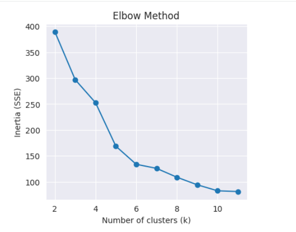

# Malls Customer Segmentation Analysis

## Project Overview

This project performs an end-to-end customer segmentation analysis using the **Mall Customers Dataset**. The objective is to identify distinct customer groups based on demographic attributes and spending behavior, enabling data-driven marketing and business decision-making.

Unsupervised learning (K-Means clustering) is applied after thorough data exploration, preprocessing, and feature engineering to uncover meaningful customer segments.


## Objectives

* Understand customer demographics and spending patterns
* Engineer meaningful features to enhance clustering performance
* Segment customers using K-Means clustering
* Evaluate the optimal number of clusters using inertia and silhouette score
* Translate analytical findings into actionable business insights


## Dataset Description

The dataset contains information about mall customers, including:

| Feature                | Description                  |
| ---------------------- | ---------------------------- |
| CustomerID             | Unique customer identifier   |
| Gender                 | Customer gender              |
| Age                    | Customer age                 |
| Education              | Highest education level      |
| Marital Status         | Marital status               |
| Annual Income (k$)     | Annual income in thousands   |
| Spending Score (1–100) | Mall spending behavior score |


## 🔧 Tools & Technologies

* **Python**
* **Pandas & NumPy** – Data manipulation
* **Matplotlib & Seaborn** – Data visualization
* **Scikit-learn** – Feature scaling and K-Means clustering
* **Jupyter Notebook** – Interactive analysis


## 🧹 Data Preparation & Feature Engineering

Key preprocessing steps included:

* Handling categorical variables
* Feature scaling using StandardScaler
* Creating new ratio-based features:

  * **Income-to-Spending Ratio**
  * **Age-to-Income Ratio**

These engineered features improved cluster separability and interpretability.


## Clustering Methodology

* Applied **K-Means clustering** on scaled numerical features
* Tested multiple values of *k*
* Evaluated performance using:

  * **Elbow Method (Inertia)**
  * **Silhouette Score**
 


- The elbow plot shows a sharp decrease in inertia from k = 2 to k = 4, after which the rate of improvement slows noticeably.
- This suggests an optimal number of clusters around k = 4 (possibly k = 5 as a secondary option), where adding more clusters yields diminishing returns in reducing SSE
- The optimal number of clusters was selected based on a balance between cohesion and separation.

## Results & Cluster Profiles

The analysis revealed distinct customer segments such as:

* High-income, high-spending customers
* Budget-conscious customers with low spending scores
* Young customers with high engagement potential
* Older customers with stable but moderate spending behavior

Each cluster was profiled using mean age, income, and spending score.


## 💡 Business Insights & Recommendations

* Target high-spending clusters with loyalty programs and premium offers
* Use personalized promotions to convert mid-income, low-spending customers
* Design engagement campaigns for younger customer segments
* Optimize marketing spend by tailoring strategies to each segment


## 📁 Project Structure

```
├── data/
│   └── Mall Customers.xlsx
├── notebooks/
│   └── customer_segmentation_analysis.ipynb
├── images/
│   └── visualizations
├── README.md
```

### 📌 Key Code Snippets & Design Notes

Optimial K selection: https://gist.github.com/KoketsoMangwale/84f56de1465cbc0e0f13abaf6f06baa6

##  Future Improvements

* Experiment with alternative clustering algorithms (DBSCAN, Hierarchical)
* Incorporate additional behavioral data
* Build an interactive dashboard for business users


## 👤 Author

**Koketso**
Data Analyst | Aspiring Data Scientist


## ⭐ Acknowledgements

Dataset inspired by common retail customer segmentation use cases.

If you found this project helpful, feel free to ⭐ the repository!
