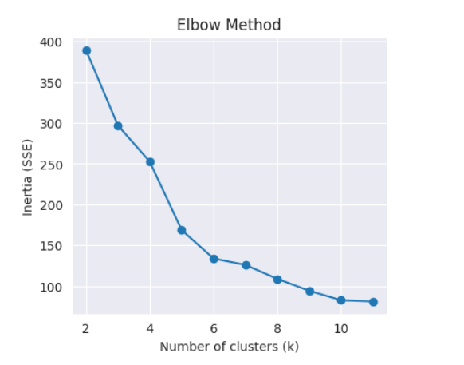
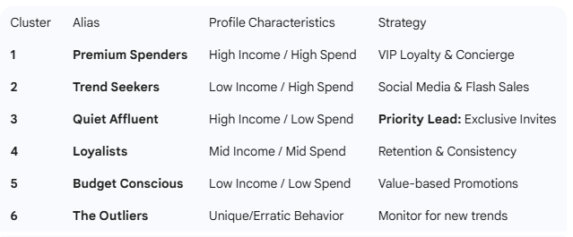

# Malls Customer Segmentation Analysis

## Project Overview

This project performs an end-to-end customer segmentation analysis using the **Mall Customers Dataset**. The objective is to identify distinct customer groups based on demographic attributes and spending behaviour, enabling data-driven marketing and business decision-making.

Unsupervised learning (K-Means clustering) is applied and PowerBI is used after thorough data exploration, preprocessing, and feature engineering to uncover hidden patterns in consumer behaviour to drive targeted marketing strategies.

## Objectives

* Understand customer demographics and spending patterns
* Segment customers using K-Means clustering
* Evaluate cluster validity using Inertia and Silhouette scores
* Translate clusters into high-value business leads

## Dataset Description

The dataset contains information about mall customers, including:

| Feature                | Description                  |
| ---------------------- | ---------------------------- |
| CustomerID             | Unique customer identifier   |
| Gender                 | Customer gender              |
| Age                    | Customer age                 |
| Education              | Highest education level      |
| Marital Status         | Marital status               |
| Annual Income (k$)     | Annual income in thousands   |
| Spending Score (1–100) | Mall spending behaviour score |

## 🔧 Tools & Technologies

* **Python** (Scikit-learn, Pandas, NumPy)
* **Data visualisation** – Matplotlib, Seaborn, and **Power BI**

## 🧹 Data Preparation & Feature Engineering

Key preprocessing steps included:

* **Feature Scaling:** Applied `StandardScaler` to ensure Income and Spending Score were weighted equally.
* **New ratio-based** features:
  * **Income-to-Spending Ratio**
  * **Age-to-Income Ratio**

These engineered features improved cluster separability and interpretability.


## Clustering Methodology: Finding the "Golden K"

* Applied **K-Means clustering** on scaled numerical features
* Tested multiple values of *k*
* Selecting the number of clusters wasn't a guess—it was a mathematical conviction using:

  ### Elbow Method (Inertia)
  * The Observation: The Inertia curve (SSE) showed a sharp decrease up to k=5, with a clear "Elbow" forming between 5 and 6.
  * The Decision: Beyond k=6, the reduction in inertia became marginal (diminishing returns), confirming k=6 as the optimal balance between complexity and accuracy.

 


  ### Silhouette Score
   * I measured the structural separation of the clusters.
  
     * The Evidence: The Silhouette Score peaked at 0.4268 when k=6.
     * The Verdict: This confirms that 6 clusters provide the most distinct and well-separated customer groups.
  
#### Customer Segmentation Approach:  
  Mall customers were segmented using K-Means clustering based on age, income, and spending behaviour.

#### Clustering Justification:
  A detailed justification covering the grouping method, assumptions, and applicability to future customers is documented here:  
#### K-Means Clustering Justification (GitHub Gist)  : https://gist.github.com/KoketsoMangwale/6d9340dc68161061be4f87b5b4d3d9e3

## Results & Cluster Profiles

The analysis revealed distinct customer segments such as:



Each cluster was profiled using mean age, income, and spending score.

## 💡 Business Insights & Recommendations

* Target high-spending clusters with loyalty programs and premium offers
* Use personalized promotions to convert mid-income, low-spending customers
* Design engagement campaigns for younger customer segments
* Optimize marketing spend by tailoring strategies to each segment

## 📁 Project Structure

```
├── data/
│   └── Mall Customers.xlsx
├── notebooks/
│   └── customer_segmentation_analysis.ipynb
├── images/
│   └── visualizations
├── README.md
```

### 📌 Key Code Snippets & Design Notes

Optimial K selection: https://gist.github.com/KoketsoMangwale/84f56de1465cbc0e0f13abaf6f06baa6


##  Future Improvements

* Experiment with alternative clustering algorithms (DBSCAN, Hierarchical)
* Incorporate additional behavioural data
* Build an interactive dashboard for business users

## 👤 Author

**Koketso**
Data Analyst | Aspiring Data Scientist

## ⭐ Acknowledgements

Dataset inspired by common retail customer segmentation use cases.

If you found this project helpful, feel free to ⭐ the repository!
